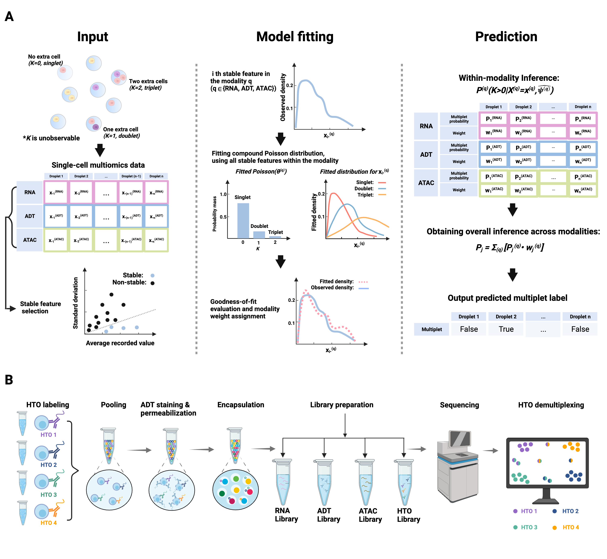

# COMPOSITE

COMPOSITE (COMpound POiSson multIplet deTEction model) is a computational tool for multiplet detection in both single-cell single-omics and multiomics  settings.
It has been implemented as an automated pipeline and is available as both a cloud-based application with a user-friendly interface and a Python package.





## Data preparation
To prepare the data from a Seurat object: [Preparing data for COMPOSITE.](https://htmlpreview.github.io/?https://github.com/CHPGenetics/COMPOSITE/blob/main/composite_data_preparation.html) We provide readily available demo datasets that can be used directly as input: [RNA.mtx](https://drive.google.com/file/d/1Tx7My5VD9ktWUvEihYbJUsz_OTHhbQmD/view?usp=sharing), [ADT.mtx](https://drive.google.com/file/d/1fg8_fbvTSQ8yBsxdks9oGwAVsV3IqNKX/view?usp=sharing), and [ATAC.mtx](https://drive.google.com/file/d/1a_g3WrlcT4-BF_VGRj06CYIo8QDJZAyz/view?usp=sharing).


## Running COMPOSITE


### Option 1: Cloud-based web app

Users may directly upload the data files to [COMPOSITE cloud-based app](https://shiny.crc.pitt.edu/shinyproj_composite/). The results will be sent to the provided email address as a .csv file.


### Option 2: Install the Python package 


Installation:
```python
pip install sccomposite==1.0.0
```
Store the RNA data, ADT data, and ATAC data respectively as "RNA.mtx", "ADT.mtx", and "ATAC.mtx" in the working directory. Import the `sccomposite` package.

```python
import sccomposite
from sccomposite import RNA_modality
from sccomposite import ADT_modality
from sccomposite import ATAC_modality
from sccomposite import Multiomics
```
We recommend users to use the default parameter settings when running COMPOSITE. COMPOSITE is a robust statistical model and the default parameters are suitable for most of the cases.  All the [results](https://github.com/CHPGenetics/COMPOSITE/tree/main/experiments/description) in our manuscript were generated under the default parameter setting. We recommand the users to use all the available modalities of data as input.

When only one modality of data is available:

```python
# RNA modality only
multiplet_classification, consistency = RNA_modality.composite_rna("RNA.mtx")

# ADT modality only
multiplet_classification, consistency = ADT_modality.composite_adt("ADT.mtx")

# ATAC modality only
multiplet_classification, consistency = ATAC_modality.composite_atac("ATAC.mtx")
```
The `multiplet_classification` variable contains the predicted multiplet label for each droplet, with "1" representing multiplet and "0" representing singlet.

The `consistency` variable contains the droplet-specific modality consistency. A higher value of consistency indicates the data in the corresponding modality are less noisy for the given droplet, resulting in a more reliable multiplet prediction result for the droplet.

When multiomics data are available:
```python
# RNA+ADT
multiplet_classification, multiplet_probability = Multiomics.composite_multiomics(RNA = "RNA.mtx", ADT =  "ADT.mtx")

# RNA+ATAC
multiplet_classification, multiplet_probability = Multiomics.composite_multiomics(RNA = "RNA.mtx", ATAC =  "ATAC.mtx")

# RNA+ADT+ATAC
multiplet_classification, multiplet_probability = Multiomics.composite_multiomics(RNA = "RNA.mtx", ADT =  "ADT.mtx", ATAC =  "ATAC.mtx")
```
The `multiplet_classification` variable contains the predicted multiplet label for each droplet, with "1" representing multiplet and "0" representing singlet.

The `multiplet_probability` variable contains the predicted probability for each droplet to be multiplet, leveraging the information across all the provided modalities. It quantifies the uncertainty of multiplet prediction results.

To save the mutiplet classification result: 

```python
import pandas as pd
data = {'multiplet_classification': multiplet_classification}

data_file = pd.DataFrame(data)
data_file.index.name = 'index'
data_file.reset_index(inplace=True)
data_file.to_csv("Multiplet_prediction.csv",index=False)
```
## Using COMPOSITE output in R

We demonstrate how to use the COMPOSITE output to remove the predicted multiplets from the Seurat object: [Eliminating multiplets.](https://htmlpreview.github.io/?https://github.com/CHPGenetics/COMPOSITE/blob/main/downstream.html)

