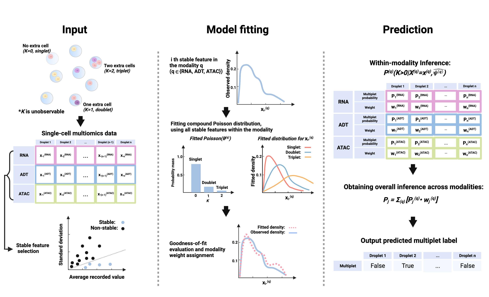

# COMPOSITE

COMPOSITE a computational tool for multiplet detection in both single-omics and multiomics single-cell settings.
It has been implemented as an automated pipeline and is available as both a cloud-based application with a user-friendly interface and a Python package .





## Data preparation
To prepare the data from a Seurat object: [Preparing data for COMPOSITE](https://htmlpreview.github.io/?https://github.com/HAH112/COMPOSITE/blob/main/composite_data_preparation.html)

## Running COMPOSITE


### Option 1: Cloud-based web app

[COMPOSITE cloud-based app](https://ondemand.htc.crc.pitt.edu/rnode/htc-n42.crc.pitt.edu/63206/?#)

Note that in order to leverage GPU for acceleration, please use the Python package.


### Option 2: Install the Python package 


Installation:
```
pip install sccomposite
```
Store the RNA data, ADT data, and ATAC data respectively as "RNA.mtx", "ADT.mtx", and "ATAC.mtx" in the working directory. Import the `sccomposite` package.

```
import sccomposite
from sccomposite import RNA_modality
from sccomposite import ADT_modality
from sccomposite import ATAC_modality
from sccomposite import Multiomics
```
We recommend users to use the default parameter settings when running COMPOSITE. COMPOSITE is a robust statistical model and the default parameters are suitable for most of the cases. The default parameter setting was used to generate the results in our manuscript. 

When only one modality of data is available:

```
# RNA modality only
multiplet_classification, consistency = RNA_modality.composite_rna("RNA.mtx")

# ADT modality only
multiplet_classification, consistency = ADT_modality.composite_adt("ADT.mtx")

# ATAC modality only
multiplet_classification, consistency = ATAC_modality.composite_atac("ATAC.mtx")
```
The `multiplet_classification` variable contains the predicted multiplet label for each droplet, with "1" representing multiplet and "0" representing singlet.

The `consistency` variable contains the droplet-specific modality consistency. A higher value of consistency indicates the data in the corresponding modality are less noisy for the given droplet.

When multiomics data is available:
```
# RNA+ADT
multiplet_classification, multiplet_probability = Multiomics.composite_multiomics(RNA = "RNA.mtx", ADT =  "ADT.mtx")

# RNA+ATAC
multiplet_classification, multiplet_probability = Multiomics.composite_multiomics(RNA = "RNA.mtx", ATAC =  "ATAC.mtx")

# RNA+ADT+ATAC
multiplet_classification, multiplet_probability = Multiomics.composite_multiomics(RNA = "RNA.mtx", ADT =  "ADT.mtx", ATAC =  "ATAC.mtx")
```
The `multiplet_classification` variable contains the predicted multiplet label for each droplet, with "1" representing multiplet and "0" representing singlet.

The `multiplet_probability` variable contains the predicted probability for each droplet to be multiplet, leveraging the information across all the provided modalities.

To save the mutiplet classification result: 

```
data = {'multiplet_classification': doublet_classification}

data_file = pd.DataFrame(data)
data_file.index.name = 'index'
data_file.reset_index(inplace=True)
data_file.to_csv("Multiplet_prediction.csv",index=False)
```

